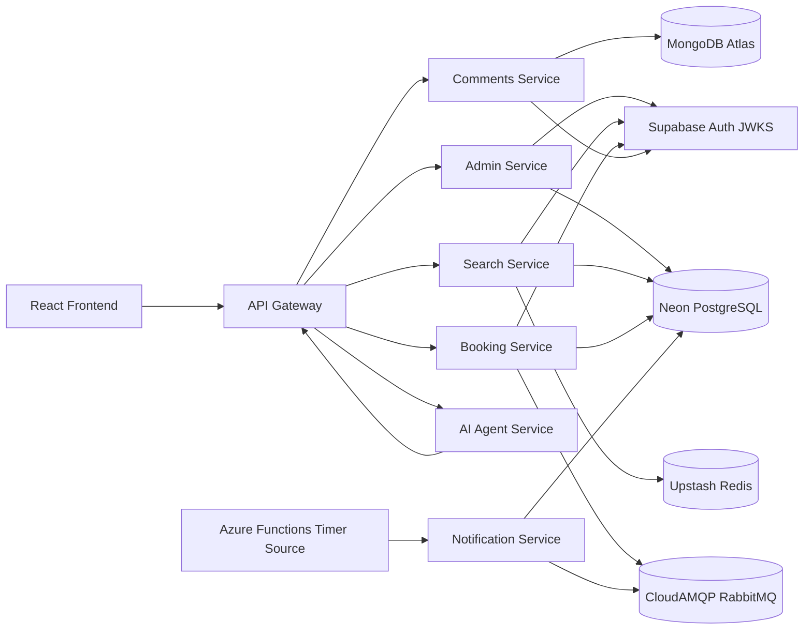
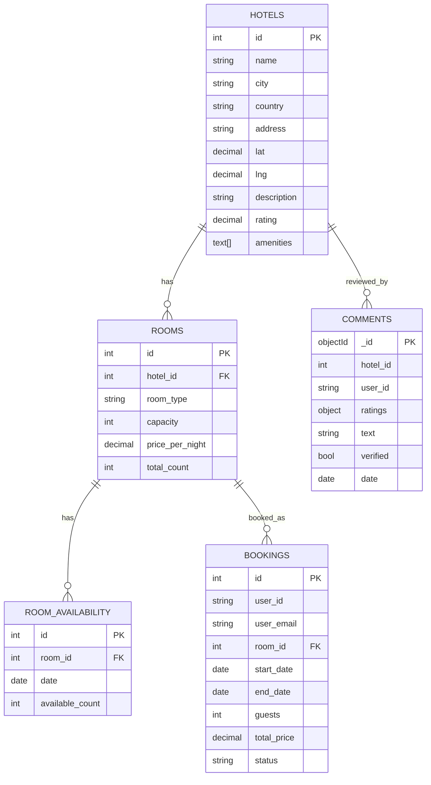

# Hotel Booking System

SE 4458 Final Project - microservices-based hotel booking platform.

Developer: Berk Ates, Yasar University, Software Engineering, Spring 2026.

## Deployed URLs

| Component | URL |
|---|---|
| Frontend | https://hotel-booking-frontend-e6f4.onrender.com |
| API Gateway | https://hotel-gateway-service.onrender.com |
| Admin Service | Local/admin code included; not deployed separately on Render free tier |
| Search Service | https://hotel-booking-system-0dh1.onrender.com |
| Booking Service | https://hotel-booking-service-5l77.onrender.com |
| Comments Service | https://hotel-comments-service.onrender.com |
| Notification Service | https://hotel-notification-service.onrender.com |
| AI Agent Service | https://hotel-ai-agent-service.onrender.com |

## Features

- Service-oriented architecture with 7 Express services and one React frontend.
- API versioning under `/api/v1`.
- Supabase Auth with ES256 JWT verification through JWKS.
- Neon PostgreSQL for hotels, rooms, availability, and bookings.
- MongoDB Atlas for hotel comments and rating summaries.
- Upstash Redis cache-aside for hotel details.
- CloudAMQP RabbitMQ queue for reservation notifications.
- Notification cron endpoints deployed on Render; Azure Functions Timer Trigger source included for cloud scheduling.
- OpenAI `gpt-4o-mini` AI Agent with tool calling.
- React + Vite + Tailwind + Leaflet frontend using the API Gateway as the single entry point.

## Architecture

See [docs/architecture.md](docs/architecture.md).



## Data Model

See [docs/er-diagram.md](docs/er-diagram.md).



## Services

| Service | Port | Status | Main endpoints |
|---|---:|---|---|
| Gateway | 3000 | Done | `/health`, `/api/v1/*` proxies |
| Admin | 3001 | Done | `/api/v1/hotels`, `/api/v1/rooms`, `/api/v1/rooms/:id/availability` |
| Search | 3002 | Done | `/api/v1/hotels/search`, `/api/v1/hotels/:id` |
| Booking | 3003 | Done | `/api/v1/bookings`, `/api/v1/bookings/me` |
| Comments | 3004 | Done | `/api/v1/hotels/:id/comments`, `/summary` |
| Notification | 3005 | Done | `/cron/check-capacity`, `/cron/process-reservations` |
| AI Agent | 3006 | Done | `/api/v1/ai/chat` |
| Frontend | 5173 | Done | Search, details, auth, bookings, admin, AI widget |

## Local Setup

Create service `.env` files from local secrets. Real credentials are not committed.

Required local secret keys in `C:\Users\berka\Desktop\hotel-secrets.txt`:

```text
DATABASE_URL=...
MONGODB_URI=...
SUPABASE_URL=...
SUPABASE_PUBLISHABLE_KEY=...
UPSTASH_REDIS_REST_URL=...
UPSTASH_REDIS_REST_TOKEN=...
AMQP_URL=...
OPENAI_API_KEY=...
```

Install dependencies per service:

```powershell
cd services/search; npm install
cd ../booking; npm install
cd ../comments; npm install
cd ../notification; npm install
cd ../ai-agent; npm install
cd ../gateway; npm install
cd ../../frontend; npm install
```

Run services in separate terminals:

```powershell
cd services/admin; node index.js
cd services/search; node index.js
cd services/booking; node index.js
cd services/comments; node index.js
cd services/notification; node index.js
cd services/ai-agent; node index.js
cd services/gateway; node index.js
cd frontend; npm run dev
```

## Verification

Completed smoke tests:

- Admin service: health, missing token 401, normal user 403, admin hotels/rooms list.
- Search service: public search, authenticated discount fields, Redis cache miss/hit.
- Comments service: public list/summary, authenticated write, cleanup.
- Booking service: authenticated booking transaction, availability decrement, RabbitMQ publish, cleanup.
- Notification service: capacity check and queue consumer.
- AI Agent service: OpenAI key, chat response, gateway-routed search tool.
- Gateway: Search, Comments, Booking auth, AI chat, AI tool routing.
- Frontend: `npm run build`.
- Scheduler: notification cron endpoints verified; Azure Functions Timer Trigger source added under `scheduler/azure-functions`.

## Demo

See [docs/demo.md](docs/demo.md) for the local demo runbook.

## Deployment Notes

See [docs/deployment.md](docs/deployment.md) for the service-by-service deployment runbook.

Backend deployment used Render Web Services because the Azure for Students subscription was disabled during final deployment.

Frontend deployment used Render Static Site.

Notification scheduler source is included under `scheduler/azure-functions`. Required Function App setting if deployed to Azure Functions later:

```text
NOTIFICATION_URL=https://<notification-service-url>
```

Frontend environment variables:

```text
VITE_API_GATEWAY_URL=https://<gateway-url>
VITE_SUPABASE_URL=...
VITE_SUPABASE_PUBLISHABLE_KEY=...
```

## Assumptions

- Supabase handles all authentication; services do not implement local auth.
- Email confirmation is disabled for test users.
- Discounted member price is 15% off and appears only with a valid Bearer token.
- Availability search treats the selected date range as inclusive because seed availability is daily.
- Notification delivery is represented by `console.log`, as allowed for grading.
- Dockerfiles are included, but Docker images are not built or pushed.

## Demo Video

https://drive.google.com/file/d/1Rfynegl3pOd8-0gJPEFTXcUswiLeffiO/view?usp=sharing
