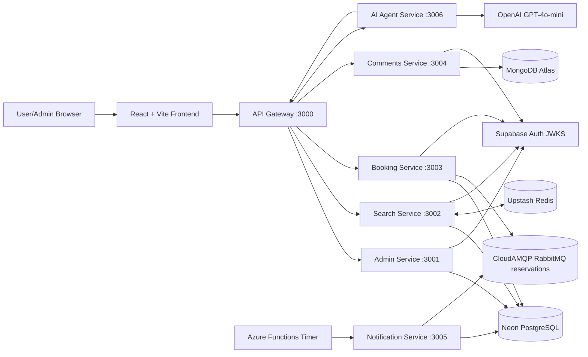
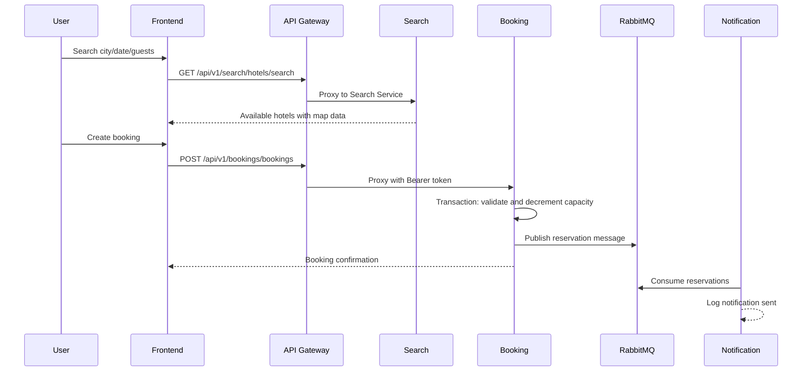

# Architecture Diagram

```mermaid
flowchart LR
  User[User/Admin Browser] --> Frontend[React + Vite Frontend]
  Frontend --> Gateway[API Gateway :3000]

  Gateway --> Admin[Admin Service :3001]
  Gateway --> Search[Search Service :3002]
  Gateway --> Booking[Booking Service :3003]
  Gateway --> Comments[Comments Service :3004]
  Gateway --> AI[AI Agent Service :3006]

  Scheduler[Azure Functions Timer] --> Notification[Notification Service :3005]

  Admin --> Postgres[(Neon PostgreSQL)]
  Search --> Postgres
  Booking --> Postgres
  Notification --> Postgres

  Search <--> Redis[(Upstash Redis)]
  Comments --> Mongo[(MongoDB Atlas)]

  Booking --> Queue[(CloudAMQP RabbitMQ reservations)]
  Notification --> Queue

  AI --> Gateway
  AI --> OpenAI[OpenAI GPT-4o-mini]

  Admin --> Supabase[Supabase Auth JWKS]
  Search --> Supabase
  Booking --> Supabase
  Comments --> Supabase
```

## Request Flow

```mermaid
sequenceDiagram
  participant U as User
  participant F as Frontend
  participant G as API Gateway
  participant S as Search
  participant B as Booking
  participant Q as RabbitMQ
  participant N as Notification

  U->>F: Search city/date/guests
  F->>G: GET /api/v1/search/hotels/search
  G->>S: Proxy to Search Service
  S-->>F: Available hotels with map data

  U->>F: Create booking
  F->>G: POST /api/v1/bookings/bookings
  G->>B: Proxy with Bearer token
  B->>B: Transaction: validate and decrement capacity
  B->>Q: Publish reservation message
  B-->>F: Booking confirmation

  N->>Q: Consume reservations
  N-->>N: Log notification sent
```
