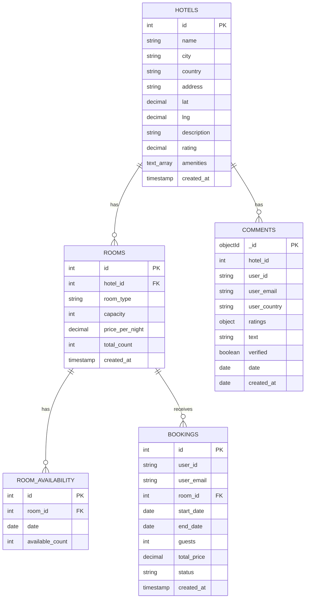

# ER Diagram

```mermaid
erDiagram
  HOTELS ||--o{ ROOMS : has
  ROOMS ||--o{ ROOM_AVAILABILITY : has
  ROOMS ||--o{ BOOKINGS : receives
  HOTELS ||--o{ COMMENTS : has

  HOTELS {
    int id PK
    string name
    string city
    string country
    string address
    decimal lat
    decimal lng
    string description
    decimal rating
    text_array amenities
    timestamp created_at
  }

  ROOMS {
    int id PK
    int hotel_id FK
    string room_type
    int capacity
    decimal price_per_night
    int total_count
    timestamp created_at
  }

  ROOM_AVAILABILITY {
    int id PK
    int room_id FK
    date date
    int available_count
  }

  BOOKINGS {
    int id PK
    string user_id
    string user_email
    int room_id FK
    date start_date
    date end_date
    int guests
    decimal total_price
    string status
    timestamp created_at
  }

  COMMENTS {
    objectId _id PK
    int hotel_id
    string user_id
    string user_email
    string user_country
    object ratings
    string text
    boolean verified
    date date
    date created_at
  }
```
